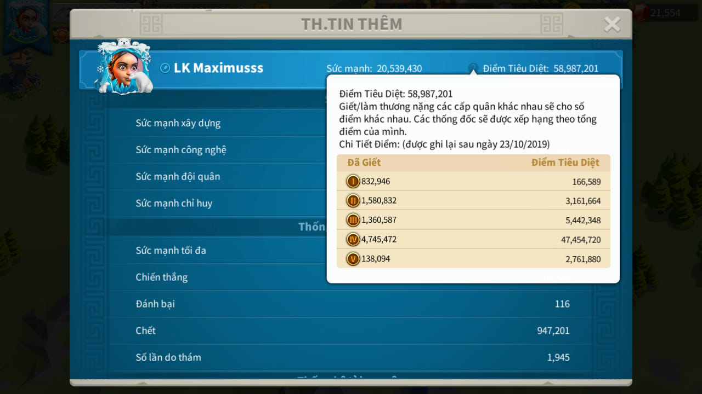
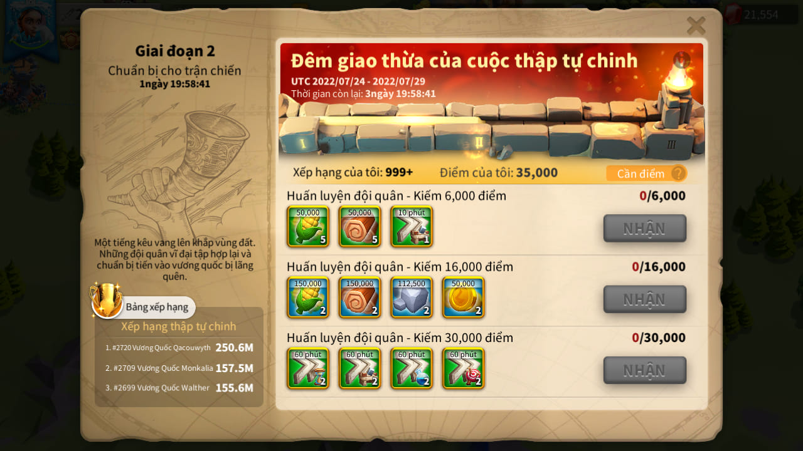

## Rise of Kingdoms KVK Preparation Player Extracting API

Just need to call a POST request to /uploads endpoint, add 3 following files:

1. Profile screen image



2. Info screen with kill point pop-up image


3. Pre-kvk screen image



Example result: 

```javascript
{
    "Id": "121607730)",
    "Kill points": [
        "832,946",
        "1,580,832",
        "1,360,587",
        "'4,745,472",
        "138,094"
    ],
    "Name": "LK Maximusss",
    "Power": "20,539,430",
    "Pre-kvk points": "35,000"
}
```
